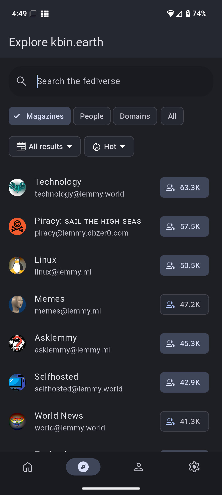
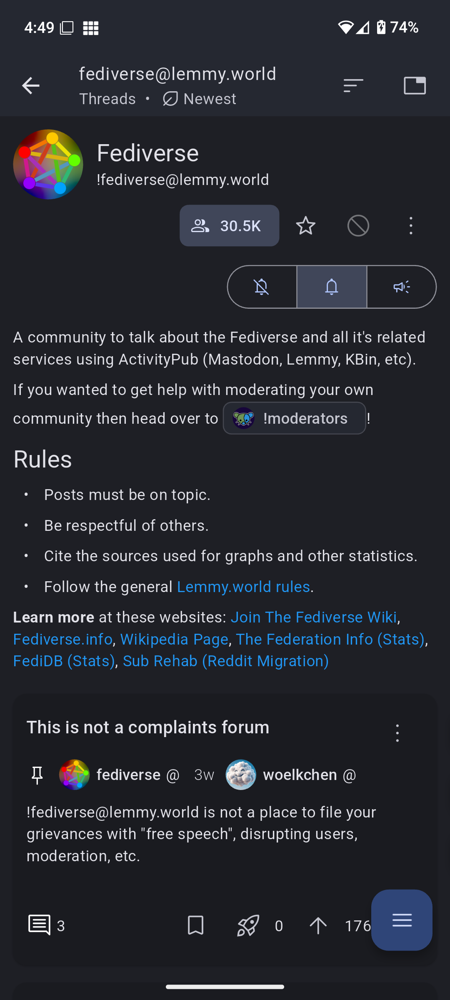

# Interstellar

An app for Mbin and Lemmy; connecting you to the fediverse.

## Downloads

Interstellar supports Android, Linux, and Windows, with more to come.

Available for Arch Linux via the AUR: [interstellar-bin](https://aur.archlinux.org/packages/interstellar-bin).

See the [latest release](https://github.com/jwr1/interstellar/releases/latest) for more downloads (.APK, .AppImage, .exe, etc.).

## Discussion

You can ask questions, report bugs, make suggestions, etc., to any of the following:

- [GitHub](https://github.com/jwr1/interstellar/issues)
- [Mbin](https://kbin.earth/m/interstellar)
- [Matrix](https://matrix.to/#/#interstellar-space:matrix.org)

## Screenshots

</img>
</img>
</img>
</img>

## Contributing

Interstellar uses [Flutter](https://flutter.dev) as its framework, so make sure you have the [Flutter SDK installed](https://docs.flutter.dev/get-started/install) before doing anything else. Then, run `flutter doctor -v` to see instructions for setting up different build platforms (e.g. android studio for APKs). While developing on Linux, you will also need to install `libmpv` from your distro. Once all that's done, use `dart run build_runner build -d` to build the generated code for models (this only needs to run once unless you modify one of the models). Finally, you can use `flutter run` to develop, and `flutter build {platform}` for release files.

### Generating app icon

The app icon is under the `assets/icons` folder, where the `logo.png` file is just the transparent one overlayed on the current background color `#423862`. This is generated with the [flutter_launcher_icons](https://pub.dev/packages/flutter_launcher_icons) package, and all relevant configuration is in the `pubspec.yaml` file.

Icons created by [Benjamin Mathis](https://github.com/BenjMathis1)

To generate a new icon, simply run the following: `dart run flutter_launcher_icons`

## Translating

Interstellar uses the [Hosted Weblate](https://hosted.weblate.org/engage/interstellar/) to make translating as easy as possible. If you'd like to help, feel free to create an account there and start translating!
